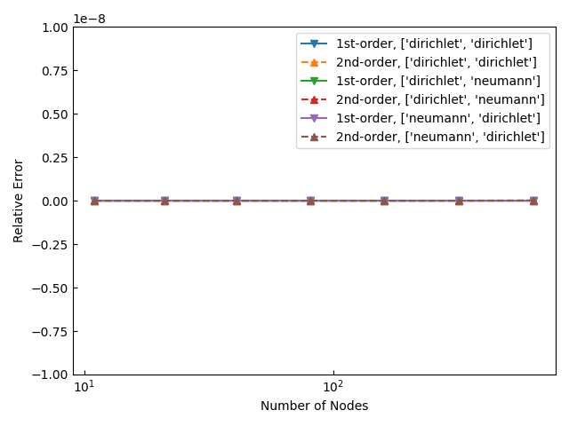
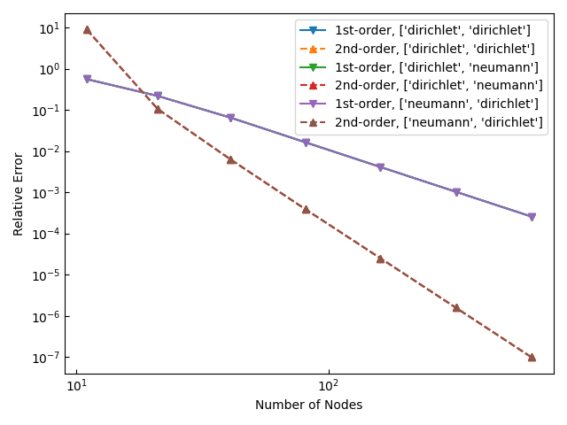
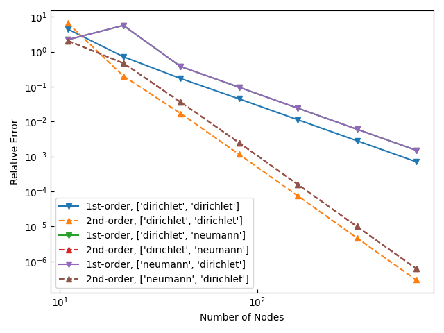

1D Finite Element Method: Comparison of Shape Functions
========================================================

Laplace方程式及びPoisson方程式、Helmholtz方程式の境界値問題を本モジュールで解いた結果を一次形状関数と二次形状関数の場合で比較する。

Laplace問題
----------------------------------------

    相対誤差の節点数への依存性

Poisson問題
----------------------------------------

    相対誤差の節点数への依存性

Helmholtz問題
----------------------------------------

    相対誤差の節点数への依存性