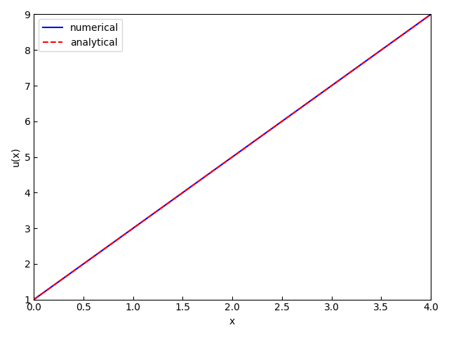
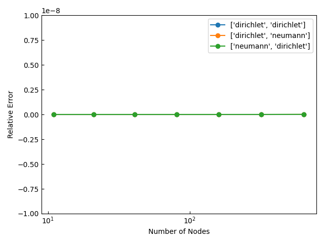
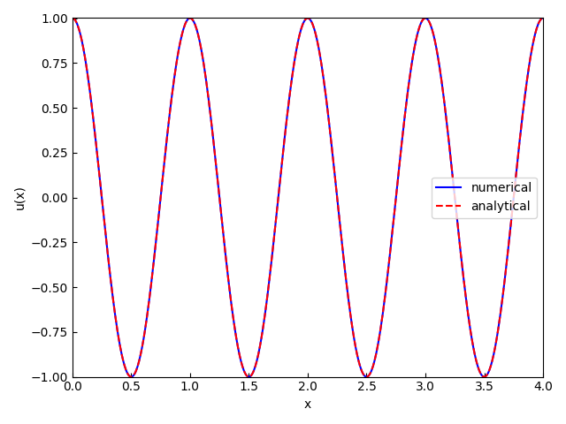
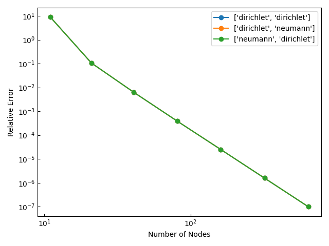
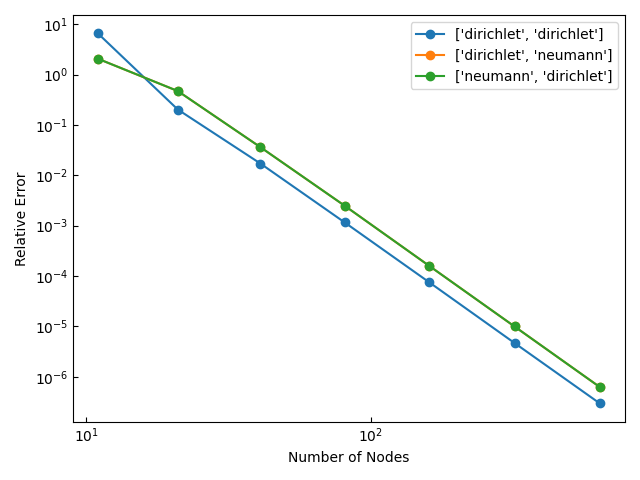

1D Finite Element Method: Second-order Shape Function
========================================

Laplace方程式 :eq:`Laplace方程式` 及びPoisson方程式 :eq:`Poisson` 、Helmholtz方程式 :eq:`Helmholtz` の境界値問題を本モジュールで解いた結果を示す。

.. math::
   \frac{du}{dx} = 0 \qquad x \in [x_\min, x_\max]
   :label: Laplace方程式

.. math::
   \frac{du}{dx} + f = 0 \qquad x \in [x_\min, x_\max]
   :label: Poisson

.. math::
   \frac{du}{dx} + k^2 u = 0 \qquad x \in [x_\min, x_\max]
   :label: Helmholtz

境界条件としてDirichlet境界条件 :eq:`Dirichlet` とNeumann境界条件 :eq:`Neumann` を用いる。

.. math::
   u = \alpha \qquad x = x_\text{D}
   :label: Dirichlet

.. math::
   \frac{du}{dx} = \beta \qquad x = x_\text{N}
   :label: Neumann

境界 :math:`x = x_\min, x_\max` へ境界条件を課す組み合わせは以下の３通りある。

#. 両端にDirichlet境界条件を課す
#. 左端にDirichlet境界条件を、右端にNeumann境界条件を課す
#. 左端にNeumann境界条件を課す、右端にDirichlet境界条件を課す

但し、:math:`f(x)` は対象領域 :math:`[x_\min, x_\max]` 内の既知関数であり、:math:`\alpha` 及び :math:`\beta` は既知の境界値であり、:math:`u(x)` は未知関数（方程式の解）である。
さらに、:math:`x_\text{D}` と :math:`x_\text{N}` はそれぞれDirichlet境界条件とNeumann境界条件が課された境界である。
また、:math:`k^2` はHelmholtz方程式の母数で既知である。

Laplace問題
----------------------------------------

境界値問題の解が以下になるように問題設定した。

.. math::
   u(x) = 2 x + 1

   x_\min = 0

   x_\max = 4

    解析解と数値解の比較（両端にDirichlet境界条件を課し、節点数を641とした場合）

    相対誤差の節点数への依存性

Poisson問題
----------------------------------------

境界値問題の解が以下になるように問題設定した。

.. math::
   u(x) = \cos(2 \pi x)

   x_\min = 0

   x_\max = 4

    解析解と数値解の比較（両端にDirichlet境界条件を課し、節点数を641とした場合）

    相対誤差の節点数への依存性

Helmholtz問題
----------------------------------------

.. math::
   u(x) = \cos(2 \pi x)

   k^2 = - 4 \pi^2

   x_\min = 0

   x_\max = 4

    解析解と数値解の比較（両端にDirichlet境界条件を課し、節点数を641とした場合）

    相対誤差の節点数への依存性